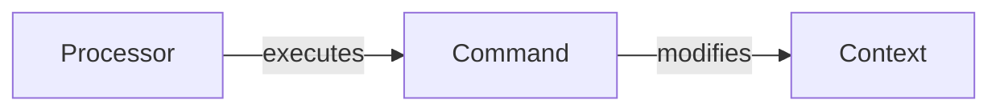

# Commands
Commands are objects that represent a single action. They are used to encapsulate the data needed to perform an action. Commands can be reverted. Commands are executed by the `Processor`.


## Context
Context is an API that modifies state of an application. You can have multiple contexts in your application. Each context is a separate module that contains all the logic related to a specific domain.

```ts
// Calculator is an state of applicaiton
class ApplicationState {
  public value: number = 0
  // ... other values ...
}

// Context that modifies "calculator" state of application
class CalculatorContext {
  constructor(private state: ApplicationState) {}
  get value() {
    return this.state.value;
  }
  public set(value: number) {
    this.state.value = value
  }
}
```

## Command
Command is an object that represents a single action. It is used to encapsulate the data needed to perform an action.

`IComannd` is a generic interface that takes two parameters: `TContext` and `TResult`. `TContext` is a type of context that will be used to execute the command. `TResult` is a type of result that will be returned after command execution.

`ICommand` has two methods: `execute` and `revert`. You should not execute the command directly. You should use `Processor` to execute the command.

```ts
import { ICommand } from '@akdasa-studios/framework/commands'

class AddCommand implements ICommand<CalculatorContext, number>  {
  constructor(private value: number) {}
  public execute(context: CalculatorContext) {
    context.set(context.value + this.value);
  }
  public revert(context: CalculatorContext) {
    context.set(context.value - this.value);
  }
}
```

## Processor
`Processor` is an object that executes commands. `Processor` has a method `execute` that takes a command and executes it. It raises an error if command was executed before. So you cannot execute the same command twice. You have to create a new command instance.

`Processor` has a method `revert` that reverts last executed command. It raises an error if there is no command to revert.

```ts
import { Processor } from '@akdasa-studios/framework/commands'

const state = new ApplicationState()
const context = new CalculatorContext(state)
const processor = new Processor(context)

const result = processor.execute(new AddCommand(1)) // result = 1
processor.revert(result)
```