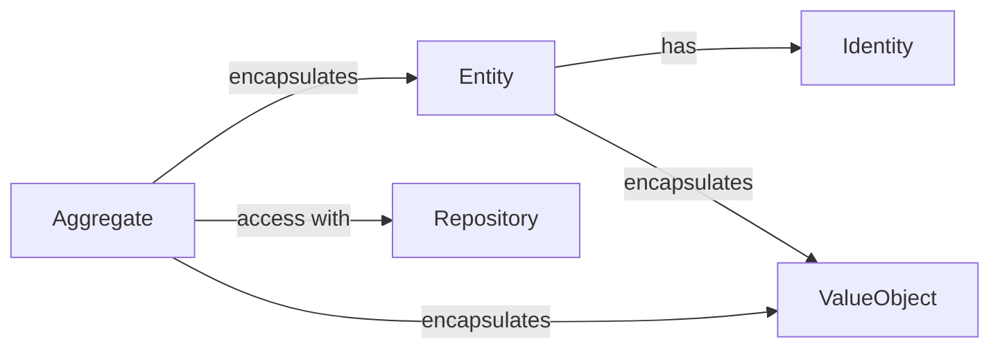

# Identity
Each _Entity_ has its _Identity_. If the identities are equal, then the objects are equal.

```js
import { Identity } from '@lib/domain/models'

type ClientId = Identity<string, 'Client'>
var client1Id = ClientId('1')
var client2Id = ClientId('2')

if (client1Id.equals(client2Id)) {
  // ...
}
```

We can also create several types of identifiers. This will help us avoid comparison/assignment of identifiers of different types. For example, we can create a _ClientId_ and _OrderId_:

```js
import { Identity } from '@lib/domain/models'

class ClientId extends Identity<string, 'Client'> {}
class OrderId extends Identity<string, 'Order'> {}

var client1Id = new ClientId('1')
var order1Id = new OrderId('1')

if (client1Id.equals(order1Id)) {
  // compilation error
}
```


# Value Object
Value Object is an object that contains some data and does not have an identity. It is used to describe some value, for example, the price of the product. The value object is immutable. It means that the value object cannot be changed after creation. If you need to change the value, you need to create a new value object.

```js
import { Value } from '@lib/domain/models'

class Name extends Value<'Name'> {
  constructor(
    public readonly firstName: string,
    public readonly lastName: string,
  ) { super() }

  isNamesake(other: Name) : boolean {
    return this.firstName === other.firstName
  }
}

const name1 = new Name('Tulasi', 'Dasa')
const name2 = new Name('Krishna', 'Dasa')
name1.equals(name2)  // false
```


# Entity
_Entity_ is a class that has an _Identity_.

```js
import { UuidIdentity } from '@lib/domain/models'

class ClientId extends UuidIdentity<'Client'> {}

class Client extends Entity<ClientId> {
  constructor(
    public name: Name,
    id?: ClientId
  ) {
    super(id || new UuidIdentity())
  }
}
```


# Repository
_Repository_ is a class that stores _Entities_ and provides access to them. The repository is used to save and retrieve _Entities_.

```js
import { InMemoryRepository } from '@lib/domain/persistence'

class ClientRepository extends InMemoryRepository<Client> {}

const clientRepository = new ClientRepository()
const client = new Client(new Name('John', 'Doe'))
clientRepository.save(client)
```

To update the _Entity_, you need to save it again:

```js
const client = clientRepository.get(uuid)
client.name = new Name('Karl', 'Smith')
clientRepository.save(client)
```


# Query
```js
import { QueryBuilder } from '@lib/domain/persistence'

const q = new QueryBuilder<Client>()
clientRepository.find(q.eq('name.firstName', 'John'))
clientRepository.find(
  q.or(
    q.eq('name.firstName', 'John'),
    q.eq('name.firstName', 'Jane')
  )
)
```
