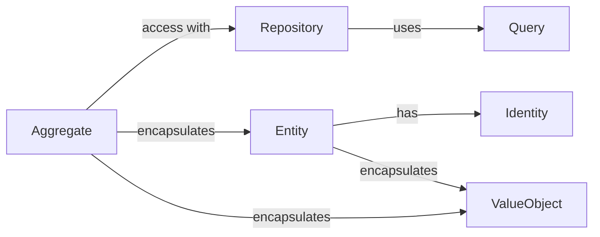

# Identity
Each _Entity_ has its _Identity_. If the identities are equal, then the objects are equal.

```js
import { Identity } from '@lib/domain/models'

class ProductId extends Identity<string, 'Product'> {}
var product1Id = new ProductId('1')
var product2Id = new ProductId('2')

if (product1Id.equals(product2Id)) {
  // ...
}
```

We can also create several types of identifiers. This will help us avoid comparison/assignment of identifiers of different types. For example, we can create a _ProductId_ and _OrderId_:

```js
import { Identity } from '@lib/domain/models'

class ProductId extends Identity<string, 'Product'> {}
class OrderId extends Identity<string, 'Order'> {}

var product1Id = new ProductId('1')
var order1Id = new OrderId('1')

if (product1Id.equals(order1Id)) {
  // compilation error
}
```


# Value Object
Value Object is an object that contains some data and does not have an identity. It is used to describe some value, for example, the price of the product. The value object is immutable. It means that the value object cannot be changed after creation. If you need to change the value, you need to create a new value object.

```js
import { Value } from '@lib/domain/models'

class SkuCode extends Value<'ProductionInfo'> {
  constructor(
    public readonly itemName: string,
    public readonly attribute1?: string,
    public readonly attribute2?: string,
  ) { super() }

  isSameItemName(other: SkuCode) : boolean {
    return this.itemName === other.itemName
  }
}

const sku1 = new SkuCode('Lassi', 'Chikku')
const sku2 = new SkuCode('Lassi', 'Banana')
sku1.equals(sku2)  // false
sku1.isSameItemName(sku2)  // true
```


# Entity
_Entity_ is a class that has an _Identity_. An _Entity_ cannot be fetched or saved directly via _Repository_. An _Entity_ must be a part of _Aggregate_.


```js
import { UuidIdentity } from '@lib/domain/models'

class OrderLineId extends UuidIdentity<'OrderLine'> {}

class OrderLine extends Entity<OrderLineId> {
  constructor(
    public readonly product: Product,
    public readonly quantity: number,
    id?: OrderLineId
  ) {
    super(id || new UuidIdentity())
  }
}
```


# Aggregate
_Aggregate_ is a class that encapsulates _Entity_ and _ValueObject_. It is used to describe some business logic. For example, we can create an _Order_ aggregate that will contain _OrderLine_ entities and _Price_ value objects.

```js
import { UuidIdentity } from '@lib/domain/models'

class OrderId extends UuidIdentity<'Order'> {}

class Order extends Aggregate<OrderId> {
  constructor(
    public readonly lines: OrderLine[],
    public readonly price: Price,
    id?: OrderId
  ) {
    super(id || new UuidIdentity())
  }

  addLine(line: OrderLine) {
    this.lines.push(line)
  }
}
```


# Repository
_Repository_ is a class that stores _Aggregates_ and provides access to them.

```js
import { InMemoryRepository } from '@lib/domain/persistence'

class OrderRepository extends InMemoryRepository<Order> {}

const orderRepository = new OrderRepository()
const order = new Order([
  new OrderLine(new Product(...), 1),
  new OrderLine(new Product(...), 2),
])
orderRepository.save(order)
```


# Query
Use _QueryBuilder_ to create a query for specific _Aggregate_. You can create parametric queries and reuse it later.

```js
import { QueryBuilder } from '@lib/domain/persistence'

const q = new QueryBuilder<Client>()

// Build queries using builder methods
const commonLastName = q.or(
  q.eq('name.lastName', 'Smith'),
  q.eq('name.lastName', 'Jones'),
  q.eq('name.lastName', 'Williams'),
)

// Use parametric query
const olderThan = (age: number) => q.gte('age', age)
const adult = olderThan(18)

// Execute query
clientRepository.find(q.and(adult, commonLastName))
```
